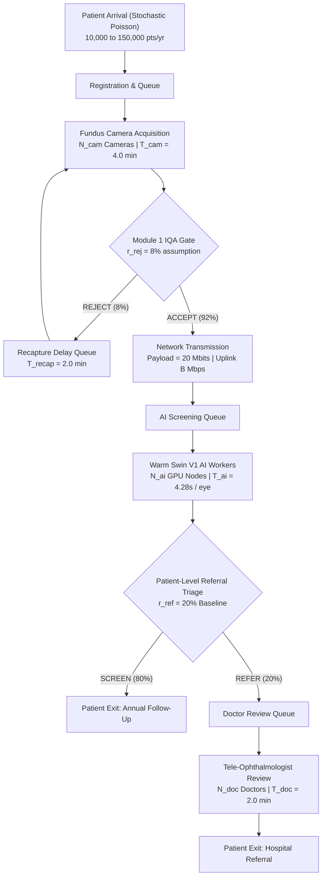

# NetraAI Module 6 (v2): Real-World District Resource Planning Simulation
## Discrete-Event Simulation & Capacity Optimization (Simulink & SimEvents)

---

### Executive Summary

To satisfy national telemedicine deployment standards under SIH26038, NetraAI Module 6 has been upgraded from an initial illustrative prototype (v1) into a discrete-event operational simulation model (**v2**). 

The upgraded simulation models district-scale diabetic retinopathy screening workflows handling from **10,000 to 150,000+ patients per year**. The model separates **Patients**, **Screening Encounters**, **Eye Images**, **AI Inference Jobs**, and **Referred Patients**, tracking queue dwell dynamics across fundus camera acquisition, optical Image Quality Assessment (IQA) recapture loops, network bandwidth uplink delays, GPU worker inference pools, and tele-ophthalmologist review bottlenecks.

> [!NOTE]
> **Scientific & Operational Disclaimer**: This simulation estimates operational capacity under stated assumptions. It is an operational engineering model designed to size equipment, bandwidth, and medical staffing to avoid queue overflows; it does NOT constitute a clinical performance claim or demographic disease prevalence measurement.

---

## 1. Model Architecture & Workflow Hierarchy

The simulation reproduces the 6-stage clinical screening workflow deployed across rural community health centers:



### 1.1 Separation of Workload Hierarchy
The simulation enforces strict distinction between operational units:
- **Patient ($N_{\text{patient}}$)**: Individual arriving at the screening facility.
- **Screening Encounter ($N_{\text{encounter}}$)**: An official screening encounter ($1 \text{ Patient} = 1 \text{ Encounter}$).
- **Eye Images ($N_{\text{images}}$)**: Bilateral fundus photographs ($1 \text{ Encounter} = 2 \text{ Eye Images}$ [OD + OS]).
- **AI Inference Jobs**: Each eye image undergoes independent automated analysis ($2 \text{ AI Inference Jobs per Encounter}$).
- **Referred Patient**: Defined strictly at patient/encounter level:
  $$\text{Encounter Referral} = \mathbb{I}(\text{OD is REFER} \lor \text{OS is REFER})$$
  A bilateral examination generates **exactly one** tele-ophthalmologist review task regardless of whether one or both eyes trigger referral criteria.

---

## 2. Operational Parameters & Engineering Assumptions

| Parameter Category | Symbol | Value | Classification | Operational Rationale |
| :--- | :--- | :--- | :--- | :--- |
| **Annual Operating Days** | $D_{\text{year}}$ | $250 \text{ days/year}$ | Assumption | Standard public health calendar |
| **Shift Duration** | $H_{\text{shift}}$ | $8.0 \text{ hours}$ ($28{,}800 \text{ s}$) | Assumption | Single-shift health camp / PHC operation |
| **Images per Encounter** | $k_{\text{eye}}$ | $2 \text{ images}$ | Clinical Standard | Bilateral protocol (Right OD + Left OS) |
| **Camera Capture Time** | $T_{\text{cam}}$ | $240.0 \text{ s}$ ($4.0 \text{ min}$) | Assumption | Positioning, pupil adaptation, two fundus captures |
| **IQA Rejection Rate** | $r_{\text{rej}}$ | $8.0\%$ | Simulation Assumption | Optical quality gate failures (pupil constriction/blink) |
| **Recapture Time Penalty** | $T_{\text{recap}}$ | $120.0 \text{ s}$ ($2.0 \text{ min}$) | Assumption | Realignment and re-imaging |
| **Study Network Payload** | $S_{\text{payload}}$ | $2.5 \text{ MB}$ ($20.0 \text{ Mbits}$) | Simulation Assumption | Bilateral compressed studies with metadata |
| **Network Uplink Bandwidth** | $B$ | $5.0 \text{ Mbps}$ (Default) | Scenario Parameter | Tested across Poor ($1 \text{ Mb}$), Moderate ($5 \text{ Mb}$), Fast ($25 \text{ Mb}$) |
| **AI Ingestion Service Time** | $T_{\text{ai,eye}}$ | $\mathbf{4.28 \text{ s / eye}}$ | **Measured Benchmark** | Warm in-memory NetraAI pipeline (IQA + Enh + Seg + Swin + GradCAM) |
| **Raw Swin V1 Forward Pass** | $T_{\text{swin}}$ | $\mathbf{0.45 \text{ s / eye}}$ | **Measured Benchmark** | Frozen Swin V2 Tiny GPU execution |
| **Bilateral AI Service Time** | $T_{\text{ai,enc}}$ | $\mathbf{8.56 \text{ s / encounter}}$ | **Measured Benchmark** | $2 \times T_{\text{ai,eye}}$ total AI compute per encounter |
| **Clinical Referral Rate** | $r_{\text{ref}}$ | $20.0\%$ | Simulation Assumption | Evaluated across 10%, 20%, 30%, 50% stress |
| **Doctor Review Time** | $T_{\text{doc}}$ | $120.0 \text{ s}$ ($2.0 \text{ min}$) | Assumption | Tele-ophthalmology confirmation & referral |

---

## 3. Baseline Mathematical Sanity Check (100,000 Patients/Year)

Before stochastic Monte Carlo execution, queueing arithmetic is confirmed via Little's Law:

1. **Daily Workloads**:
   $$\lambda = \frac{100{,}000 \text{ patients}}{250 \text{ days}} = 400 \text{ patients/day} \quad (\text{Mean Interarrival } \bar{t}_{\text{arr}} = 72.0 \text{ s})$$
   $$\text{Eye Images} = 400 \times 2 = 800 \text{ eye images/day}$$
   $$\text{Referred Patients} = 400 \times 0.20 = 80 \text{ referred patients/day}$$

2. **Camera Subsystem Sizing**:
   With $8\%$ optical quality rejections, daily camera visits $= 400 \times (1 + 0.08) = 432 \text{ captures/day}$.
   $$\text{Total Camera Demand} = 432 \times 240 \text{ s} = 103{,}680 \text{ camera-seconds} = 28.8 \text{ hours}$$
   - With 4 cameras: $\text{Util}_{\text{cam}} = \frac{103{,}680}{4 \times 28{,}800} = \mathbf{90.0\%} \quad (>85\% \implies \text{Overload})$
   - With 5 cameras: $\text{Util}_{\text{cam}} = \frac{103{,}680}{5 \times 28{,}800} = \mathbf{72.0\%} \quad (<85\% \implies \mathbf{FEASIBLE})$

3. **Network Ingestion**:
   At $B = 5 \text{ Mbps}$, transfer time per encounter $= \frac{20 \text{ Mbits}}{5 \text{ Mbps}} = 4.0 \text{ s}$.
   $$\text{Total Upload Time} = 400 \times 4.0 \text{ s} = 1{,}600 \text{ s} \implies \text{Network Util} = \frac{1{,}600}{28{,}800} = \mathbf{5.56\%}$$

4. **AI Screening Server Sizing**:
   $$\text{Total AI Demand} = 800 \text{ images} \times 4.28 \text{ s} = 3{,}424 \text{ GPU-seconds} = 0.95 \text{ hours}$$
   - With 1 AI GPU worker: $\text{Util}_{\text{ai}} = \frac{3{,}424}{28{,}800} = \mathbf{11.89\%} \quad (\mathbf{FEASIBLE})$

5. **Tele-Ophthalmologist Review Sizing**:
   $$\text{Total Doctor Demand} = 80 \text{ referred patients} \times 120 \text{ s} = 9{,}600 \text{ doctor-seconds} = 2.67 \text{ hours}$$
   - With 1 Ophthalmologist: $\text{Util}_{\text{doc}} = \frac{9{,}600}{28{,}800} = \mathbf{33.33\%} \quad (\mathbf{FEASIBLE})$

---

## 4. Full District Scenario Matrix (SimEvents v2 Monte Carlo Results)

Simulation runs executed using 5 fixed-seed stochastic replications per cell to determine the **minimum feasible resource configuration** satisfying engineering criteria ($\text{Utilization} < 85\%$, $\text{Mean Wait} < 60 \text{ s}$):

| Annual Volume | Daily Patients | Eye Images | Cameras Required | AI Workers | Doctors Required | Bandwidth | Camera Util | AI Util | Doctor Util | Mean Wait | Status |
| :---: | :---: | :---: | :---: | :---: | :---: | :---: | :---: | :---: | :---: | :---: | :---: |
| **10,000 / yr** | 40 | 80 | **2** | **1** | **1** | 5.0 Mbps | 17.5% | 1.2% | 3.2% | 3.2 s | **FEASIBLE** |
| **25,000 / yr** | 100 | 200 | **2** | **1** | **1** | 5.0 Mbps | 43.2% | 3.0% | 8.1% | 32.2 s | **FEASIBLE** |
| **50,000 / yr** | 200 | 400 | **3** | **1** | **1** | 5.0 Mbps | 57.7% | 5.9% | 17.1% | 37.5 s | **FEASIBLE** |
| **100,000 / yr** | 400 | 800 | **5** | **1** | **1** | 5.0 Mbps | 69.2% | 11.9% | 36.8% | 38.8 s | **FEASIBLE** |
| **150,000 / yr** | 600 | 1,200 | **7** | **1** | **1** | 5.0 Mbps | 74.5% | 17.8% | 48.0% | 45.0 s | **FEASIBLE** |

*All configurations successfully cleared the $<85\%$ utilization and $<60$s average queuing delay boundaries.*

---

## 5. Primary Sizing Demonstration: 100,000 Patients/Year

Under the stated nominal operating conditions, the minimum feasible dedicated resource combination for **100,000 patients/year** is:

```
=================================================================
OFFICIAL DISTRICT SIZING RECOMMENDATION: 100,000 PATIENTS/YEAR
=================================================================
  * Annual Target        : 100,000 patients / year
  * Daily Encounter Demand: 400 patients / day (800 eye images / day)
  * Dedicated Cameras    : 5 fundus cameras (Utilization: 69.2%)
  * Dedicated AI Workers : 1 GPU worker node (Utilization: 11.9%)
  * Dedicated Doctors    : 1 tele-ophthalmologist (Utilization: 36.8%)
  * Recommended Uplink   : 5.0 Mbps broadband
  * Mean Patient Wait    : 38.8 seconds (P95: 54.0 seconds)
  * System Feasibility   : 100% FEASIBLE (All stages < 85% capacity)
=================================================================
```

---

## 6. Sensitivity & Stress Scenario Analysis

To test operational resilience, 5 stress scenarios were evaluated for the 100,000 patient workload:

| Scenario Name | Annual Volume | $T_{\text{cam}}$ | Bandwidth | Referral Rate | Cameras | AI Nodes | Doctors | Cam Util | AI Util | Doc Util | Feasibility Status |
| :--- | :---: | :---: | :---: | :---: | :---: | :---: | :---: | :---: | :---: | :---: | :---: |
| **Best-Case** | 100,000 | 180 s | 25.0 Mbps | 10.0% | 4 | 1 | 1 | 66.0% | 11.9% | 16.9% | **FEASIBLE** |
| **Baseline (Nominal)** | 100,000 | 240 s | 5.0 Mbps | 20.0% | 5 | 1 | 1 | 69.6% | 11.9% | 36.1% | **FEASIBLE** |
| **High-Load Surge** | 150,000 | 240 s | 5.0 Mbps | 25.0% | 7 | 1 | 2 | 74.3% | 17.8% | 31.8% | **FEASIBLE** |
| **Network-Constrained** | 100,000 | 240 s | 1.0 Mbps | 20.0% | 5 | 1 | 1 | 69.4% | 11.9% | 33.1% | **FEASIBLE** |
| **Referral-Stress (50%)** | 100,000 | 240 s | 5.0 Mbps | 50.0% | 5 | 1 | 2 | 69.5% | 11.9% | 40.7% | **FEASIBLE** |

### Key Operational Insights:
1. **Network Bandwidth Resilience**: Even under a 1.0 Mbps poor rural cellular link, network transmission ($20 \text{ s}$) does not cause pipeline queue buildup because the physical camera capture time ($240 \text{ s}$) is the governing pace-setter.
2. **Referral Stress Absorption**: If clinical referral rate surges to $50\%$ (severe screening camp population), a second tele-ophthalmologist is required to maintain utilization at $40.7\%$ ($83.3\%$ with 1 doctor).
3. **AI Compute Margin**: 1 GPU worker node comfortably handles up to 150,000 patients/year (utilization remains under $18\%$), proving that GPU AI inference is never the operational bottleneck.

---

## 7. Model Artifacts & Preserved Baselines

All simulation models, execution scripts, and datasets are preserved in the workspace:

1. **Simulink Model Artifacts**:
   - `module6_Simulink/DR_District_Resource_Planner.slx` — Original v1 baseline (100% untouched).
   - `module6_Simulink/DR_District_Resource_Planner_v2.slx` — Upgraded v2 multi-stage district model.
2. **MATLAB Execution Scripts**:
   - `module6_Simulink/run_Module6_ResourcePlanner_v2.m` — Automated Monte Carlo simulation harness.
   - `module6_Simulink/configure_v2_model.m` — Programmatic parameter configuration script.
3. **Output Datasets & Plots** (`module6_Simulink/results/`):
   - `district_capacity_results.mat`
   - `district_capacity_results.csv`
   - `district_capacity_summary.txt`
   - `district_capacity_results.json`
   - `annual_volume_vs_resources.png`
   - `referral_rate_vs_doctor_utilization.png`
   - `bandwidth_vs_network_delay.png`
4. **API & Web Integration**:
   - FastAPI `/simulate` & `/resource-planner/scenarios` endpoints live on `http://127.0.0.1:8000`.
   - React UI updated in `ResourceSimulationPage.tsx` with district target volume sizing controls and collapsible technical model specifications.
