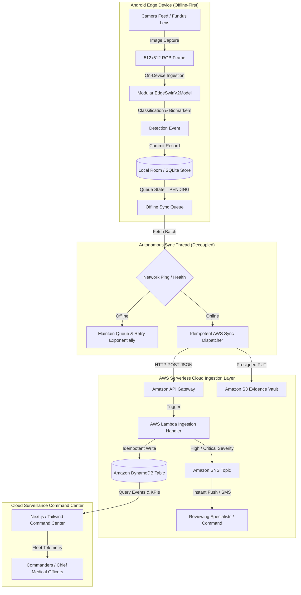
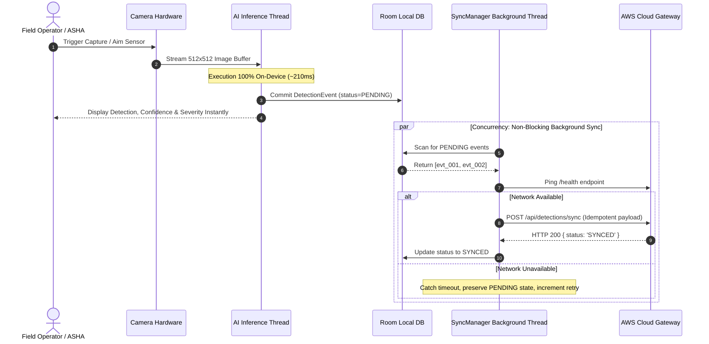

# RETINOVA Edge AI Surveillance & Diagnostic Platform
## Offline-First Edge AI Architecture & AWS Synchronization Specification

---

## 1. System Philosophy: "Detect Locally, Store Locally, Sync Intelligently, Monitor Centrally"

Traditional surveillance and clinical screening solutions rely on continuous broadband connectivity and cloud streaming. When network connectivity fails or is denied in remote rural clinics, critical industrial zones, or borders, conventional systems stop functioning entirely.

RETINOVA resolves this fundamental vulnerability by decoupling real-time edge AI inference from cloud synchronization:
1. **Zero-Latency Local AI**: Inference runs 100% on the mobile device hardware (NPU/CPU/GPU) with zero internet dependency.
2. **Local Room/SQLite Persistence**: Every detection event, confidence score, bounding box/biomarker, GPS coordinate, and evidence image is committed immediately to encrypted local storage.
3. **Autonomous Non-Blocking SyncManager**: An independent background synchronization daemon polls network availability. When connectivity returns, pending events are uploaded idempotently to AWS API Gateway, DynamoDB, and S3 without interrupting camera feed or inference.
4. **Centralized AWS Command Center**: Remote medical officers and security commanders monitor multi-node fleets, review high-severity SNS escalations, and track geographic incidence in real time.

---

## 2. End-to-End Architectural Dataflow



---

## 3. Decoupled Thread Architecture

The mobile application enforces strict concurrency separation to guarantee that heavy network synchronization never causes dropped frames or UI stuttering during live camera inspection:



---

## 4. Local Database Schema & State Machine

### Schema: `DetectionEvent`

| Field | Type | Description |
| :--- | :--- | :--- |
| `eventId` | `String (UUID)` | Primary Key (e.g., `evt_1727614200_a89f2`) |
| `deviceId` | `String` | Unique hardware identifier (`DEV-EDGE-XXX`) |
| `timestamp` | `ISO8601 String` | Exact local capture timestamp |
| `detectionType` | `String` | Diagnostic label (e.g. `Moderate NPDR`) |
| `confidence` | `Float` | Calibrated probability ($0.00 - 1.00$) |
| `severity` | `Enum` | `LOW`, `MEDIUM`, `HIGH`, `CRITICAL` |
| `latitude` | `Float` | Local GPS latitude at time of capture |
| `longitude` | `Float` | Local GPS longitude at time of capture |
| `localImagePath` | `String` | Local filesystem URI (`file:///data/...`) |
| `cloudImageUrl` | `String?` | S3 evidence URL (populated after sync) |
| `modelVersion` | `String` | Edge model version (`swinv2-tiny-edge-v1.0.4`) |
| `syncStatus` | `Enum` | `PENDING`, `SYNCING`, `SYNCED`, `FAILED` |
| `retryCount` | `Integer` | Number of sync attempts |
| `createdAt` | `ISO8601 String` | Record creation timestamp |
| `updatedAt` | `ISO8601 String` | Last state update timestamp |

### State Transition Diagram

```
[Camera Capture]
       │
       ▼
 ┌───────────┐
 │  PENDING  │ ◄─────── (Sync Failure / Timeout) ──┐
 └─────┬─────┘                                    │
       │ Network Detected & Batch Initiated        │
       ▼                                          │
 ┌───────────┐                                    │
 │  SYNCING  │ ───────────────────────────────────┤
 └─────┬─────┘                                    │
       │ HTTP 200 Verified                        │
       ▼                                          │
 ┌───────────┐                                    │
 │  SYNCED   │                                    │
 └───────────┘                                    │
       ▲                                          │
       └──────── (Manual or Auto-Retry) ──────────┘
```

---

## 5. AWS Data Model & Cloud Components

### 1. Amazon DynamoDB Table: `RetinovaDetectionEvents`
* **Partition Key (HASH)**: `device_id` (String)
* **Sort Key (RANGE)**: `timestamp` (String)
* **Global Secondary Indexes (GSI)**:
  - `EventIdIndex`: Partition Key = `event_id` (Projection: ALL)
  - `SeverityIndex`: Partition Key = `severity`, Sort Key = `timestamp` (Projection: ALL)

### 2. Amazon S3 Evidence Vault
* **Bucket Name**: `retinova-evidence-vault-<account-id>`
* **Privacy & Security**:
  - `BlockPublicAcls: true`, `BlockPublicPolicy: true`, `RestrictPublicBuckets: true`
  - Default Server-Side Encryption (`AES-256`)
  - Signed PUT URLs with 15-minute expiration
  - Lifecycle transition to Glacier after 90 days to minimize storage expenditure.

### 3. Amazon SNS Escalation Topic
* **Topic Name**: `RetinovaCriticalAlerts`
* **Trigger Policy**: Invoked by Lambda whenever `severity` is `HIGH` or `CRITICAL`.
* **Subscribers**: SMS endpoints, email distribution lists, and webhook endpoints for emergency response centers.

---

## 6. REST API Specification

### Endpoint 1: Ingest Edge Detection (Sync)
* **Method**: `POST`
* **Path**: `/api/detections/sync`
* **Headers**: `Content-Type: application/json`, `x-device-id: DEV-EDGE-001`
* **Payload**:
  ```json
  {
    "event_id": "evt_1727614200_9b83a",
    "device_id": "DEV-EDGE-001",
    "timestamp": "2026-09-29T13:00:00.000Z",
    "detection_type": "Moderate NPDR",
    "confidence": 0.942,
    "severity": "HIGH",
    "latitude": 13.0827,
    "longitude": 80.2707,
    "model_version": "swinv2-tiny-edge-v1.0.4",
    "s3_object_key": "evidence/DEV-EDGE-001/evt_1727614200_9b83a.jpg"
  }
  ```
* **Response (200 OK)**:
  ```json
  {
    "status": "SYNCED",
    "event_id": "evt_1727614200_9b83a",
    "cloudImageUrl": "https://retinova-evidence-vault.s3.ap-south-1.amazonaws.com/evidence/DEV-EDGE-001/evt_1727614200_9b83a.jpg",
    "sync_timestamp": "2026-09-29T13:00:01.120Z"
  }
  ```

### Endpoint 2: Command Center KPI Summary
* **Method**: `GET`
* **Path**: `/api/detections/overview`
* **Response (200 OK)**:
  ```json
  {
    "devicesOnline": 8,
    "devicesOffline": 2,
    "totalDevices": 10,
    "todayDetections": 124,
    "pendingSync": 7,
    "criticalAlerts": 3,
    "awsRegion": "ap-south-1",
    "s3Bucket": "retinova-evidence-vault",
    "dynamoTable": "RetinovaDetectionEvents"
  }
  ```

### Endpoint 3: Direct APK Distribution
* **Method**: `GET`
* **Path**: `/download/apk`
* **Headers**: `Content-Type: application/vnd.android.package-archive`
* **Response**: Binary stream of `NetraAI_ASHA.apk` (82.9 MB).

### Endpoint 4: QR Code & Sideload Portal
* **Method**: `GET`
* **Path**: `/install`
* **Response**: Interactive HTML portal rendering dynamic QR code, direct download links, and installation steps.
