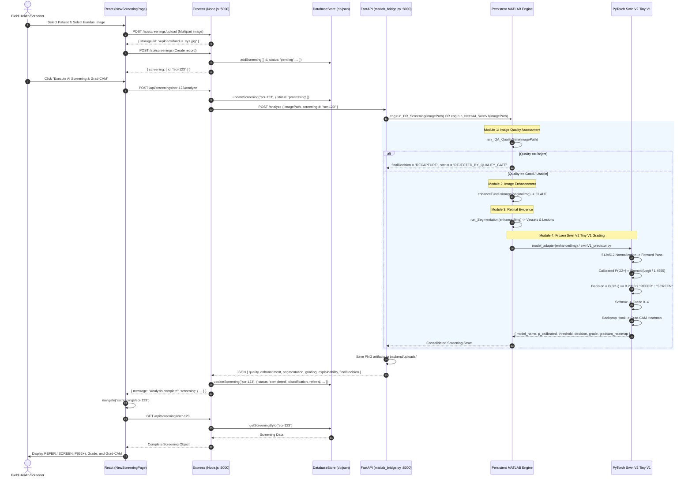

# NetraAI: Complete End-to-End Architecture & Data-Flow Audit

**Project:** SIH26038 — Explainable AI for Diabetic Retinopathy Screening in Rural India  
**Team:** Career Crafters  
**Audit Date:** September 13, 2026  
**Document Type:** Read-Only Technical Architecture & Data-Flow Audit  
**Target Document:** `DR/docs/NETRAAI_FULL_ARCHITECTURE_AUDIT.md`  

---

## Executive Summary & Root-Cause Diagnosis

### The Core Problem: Why the Web Result Displayed Stale "Grade 2 (~86.5% Confidence)"
During previous integration tests, the web interface displayed a stale **Grade 2 (Moderate Non-Proliferative DR)** with **~86.5% confidence** even though the live MATLAB/Python Swin V1 pipeline was executing and outputting different results. 

This audit traced the exact execution chain and identified **three interlocking root causes**:

1. **Silent Fallback to `MockAIService`**:  
   In [MatlabAIService.ts](file:///c:/Users/Appasaheb/OneDrive/Documents/MATLAB/NetraAI/DR/backend/src/services/ai/MatlabAIService.ts#L56-L59), if the Python FastAPI bridge (`http://127.0.0.1:8000/analyze`) fails, times out, or throws an unhandled exception, the service catches the error and **silently falls back** to [MockAIService.ts](file:///c:/Users/Appasaheb/OneDrive/Documents/MATLAB/NetraAI/DR/backend/src/services/ai/MockAIService.ts):
   ```typescript
   // MockAIService.ts line 20, 25, 88:
   const hash = this.getHash(request.imageId || request.screeningId);
   const grade = (hash % 5) as 0 | 1 | 2 | 3 | 4;
   const calibratedConfidences = [0.942, 0.884, 0.865, 0.912, 0.958];
   ```
   When `(hash % 5) === 2`, `grade = 2` and `calibrated_confidence = 0.865` (**exactly 86.5%**). The model name returned is `'APTOS-MobileNetV2-DR-Ordinal'`.
2. **Missing Filesystem Path Disconnect**:  
   [matlab_bridge.py](file:///c:/Users/Appasaheb/OneDrive/Documents/MATLAB/NetraAI/DR/backend/matlab_bridge.py#L28), [run_DR_Screening.m](file:///c:/Users/Appasaheb/OneDrive/Documents/MATLAB/NetraAI/DR_Screening_MATLAB/run_DR_Screening.m#L23), [run_NetraAI_SwinV1.m](file:///c:/Users/Appasaheb/OneDrive/Documents/MATLAB/NetraAI/DR_Screening_MATLAB/module4_Grading_Final/integration/run_NetraAI_SwinV1.m#L28), and [reportService.ts](file:///c:/Users/Appasaheb/OneDrive/Documents/MATLAB/NetraAI/DR/backend/src/services/reportService.ts#L13) hardcode:
   ```
   C:\Users\Appasaheb\OneDrive\Documents\MATLAB\DR_Screening_MATLAB
   ```
   However, on this workstation, `Test-Path 'C:\Users\Appasaheb\OneDrive\Documents\MATLAB\DR_Screening_MATLAB'` returns **FALSE**. The actual workspace path is:
   ```
   C:\Users\Appasaheb\OneDrive\Documents\MATLAB\NetraAI\DR_Screening_MATLAB
   ```
   Because the hardcoded path does not exist, persistent engine initialization, image loading, or script imports fail or crash, triggering the silent fallback to `MockAIService`.
3. **Pipeline Disconnect (MobileNetV2 vs. Frozen Swin V1)**:  
   Even when the FastAPI bridge and MATLAB engine are running:
   - `matlab_bridge.py` executes `eng.run_DR_Screening(imagePath)`.
   - `run_DR_Screening.m` invokes [module4_Grading/run_Grading.m](file:///c:/Users/Appasaheb/OneDrive/Documents/MATLAB/NetraAI/DR_Screening_MATLAB/module4_Grading/run_Grading.m) which loads the old MATLAB **MobileNetV2** model (`MobileNetV2_DR_Model.mat`).
   - The production frozen model—**Swin V2 Tiny V1**—is isolated in [module4_Grading_Final/integration/](file:///c:/Users/Appasaheb/OneDrive/Documents/MATLAB/NetraAI/DR_Screening_MATLAB/module4_Grading_Final/integration/) and is **never called** by `run_DR_Screening.m` or `matlab_bridge.py`.

---

## Three Core Architectural Paths

```mermaid
graph TD
    subgraph "CURRENT ACTIVE PATH (Web UI -> Express -> FastAPI -> Old MobileNetV2)"
        A1[React NewScreeningPage] -->|POST /api/screenings/upload| B1[Express Multer Upload]
        A1 -->|POST /api/screenings| B2[Express Create Screening]
        A1 -->|POST /api/screenings/:id/analyze| B3[ScreeningService.runAnalysis]
        B3 --> C1[MatlabAIService.analyzeImage]
        C1 -->|POST http://localhost:8000/analyze| D1[FastAPI matlab_bridge.py]
        D1 -->|eng.run_DR_Screening| E1[MATLAB run_DR_Screening.m]
        E1 --> F1[Module 1: IQA Quality Gate]
        E1 --> F2[Module 2: CLAHE Enhancement]
        E1 --> F3[Module 3: Retinal Segmentation]
        E1 -->|OLD PATH| F4[Module 4: run_Grading.m<br/>MobileNetV2_DR_Model.mat]
        E1 -->|OLD PATH| F5[Module 5: run_GradCAM.m<br/>MobileNetV2 dlnetwork]
        E1 -->|finalDecision: SCREEN / RECAPTURE| D1
        C1 -.->|IF BRIDGE FAILS / CRASHES| G1[MockAIService.analyzeImage<br/>Grade 2, 86.5% Stale Dummy]
    end

    subgraph "CURRENT ISOLATED ML PATH (Frozen Swin V1)"
        H1[run_NetraAI_SwinV1.m] --> I1[Module 1: IQA]
        H1 --> I2[Module 2: Enhancement]
        H1 --> I3[Module 3: Segmentation]
        H1 -->|model_adapter.m| I4[run_SwinV1.m / swinV1_predictor.py]
        I4 --> J1[PyTorch Swin V2 Tiny<br/>best_model.pt]
        J1 --> J2[Calibrated P(G2+) T*=1.4555]
        J2 --> J3[tau* = 0.2993 -> REFER / SCREEN]
    end

    subgraph "REQUIRED FINAL PATH (Target Production Architecture)"
        K1[React NewScreeningPage] -->|POST /api/screenings/upload| L1[Express Upload]
        K1 -->|POST /api/screenings| L2[Express Create]
        K1 -->|POST /api/screenings/:id/analyze| L3[Express ScreeningService]
        L3 --> M1[MatlabAIService<br/>NO Silent Fallback]
        M1 -->|POST /analyze| N1[FastAPI Bridge]
        N1 -->|Calls Updated Pipeline| O1[run_DR_Screening.m OR run_NetraAI_SwinV1]
        O1 --> P1[Module 1: IQA Quality Gate]
        O1 --> P2[Module 2: Enhancement]
        O1 --> P3[Module 3: Retinal Segmentation]
        O1 --> P4[Module 4: model_adapter.m<br/>Frozen Swin V2 Tiny]
        P4 --> Q1[Calibrated P(G2+) >= 0.2993 -> REFER / SCREEN]
        P4 --> Q2[5-Grade Prediction G0-G4]
        P4 --> Q3[Grad-CAM Feature Heatmap]
        N1 -->|Rich Swin V1 Payload| L3
        L3 -->|Persist Real Clinical Data| R1[db.json / PostgreSQL]
        R1 --> S1[React ScreeningResultPage<br/>Displays P(G2+), REFER/SCREEN, Grade, GradCAM]
        R1 --> S2[reportService.ts<br/>Official Clinical Report]
    end
```

### Path 1: CURRENT ACTIVE PATH (What Actually Happens in the Browser)
1. **User Action**: The user selects a patient and uploads a retinal image on `http://localhost:5173/screenings/new`.
2. **Upload Endpoint**: React calls `POST /api/screenings/upload` with `multipart/form-data`. Express saves the image to `backend/uploads/fundus_upload_<uuid>.jpg` and returns the file URL.
3. **Session Creation**: React calls `POST /api/screenings` with `{ patientId, eye, imageStorageUrl, ... }`. Express creates a pending record in `backend/data/db.json`.
4. **Analysis Trigger**: React calls `POST /api/screenings/:id/analyze`.
5. **Express Handler**: `ScreeningController.runAnalysis` calls `ScreeningService.runAnalysis(screeningId)`.
6. **AI Service Selection**: `getAIService()` returns an instance of `MatlabAIService` (`AI_SERVICE_TYPE=matlab`).
7. **HTTP Bridge Call**: `MatlabAIService` sends `POST http://127.0.0.1:8000/analyze` to `matlab_bridge.py`.
8. **Bridge Handling**:
   - `matlab_bridge.py` resolves the image path.
   - Calls `eng.run_DR_Screening(resolved_image_path)` via the MATLAB Engine for Python.
9. **MATLAB Execution**:
   - Runs `run_IQA_QualityGate.m` (Module 1). If "Reject", returns `RECAPTURE`.
   - Runs `enhanceFundusImage.m` (Module 2).
   - Runs `run_Segmentation.m` (Module 3).
   - Runs **`module4_Grading/run_Grading.m`** (Module 4) loading `MobileNetV2_DR_Model.mat` from `results/APTOS_Grading/`.
   - Runs **`run_GradCAM.m`** (Module 5) creating a `dlnetwork` from `MobileNetV2_DR_Model.mat`.
   - Sets `result.finalDecision = "SCREEN"` or `"SCREEN_WITH_QUALITY_FLAG"`. **It NEVER outputs "REFER"!**
10. **Bridge Response Formatting**:
    - `matlab_bridge.py` hardcodes:
      ```python
      "model_name": "MobileNetV2 DR Classifier"
      "model_version": "v2.6-MATLAB"
      ```
    - Saves visual PNG artifacts (`enhanced_<id>.png`, `vessels_<id>.png`, `lesions_<id>.png`, `gradcam_<id>.png`) in `backend/uploads/`.
    - Returns JSON to `MatlabAIService`.
11. **Persistence & UI View**:
    - `ScreeningService` saves the results to `db.json`.
    - React navigates to `/screenings/:id`.
    - `ScreeningResultPage.tsx` loads the record via `GET /api/screenings/:id` and displays the MobileNetV2 result.
12. **The Failure Fallback**:
    - If `matlab_bridge.py` is not running or crashes (due to the missing `C:\Users\Appasaheb\OneDrive\Documents\MATLAB\DR_Screening_MATLAB` path), `MatlabAIService` catches the exception and immediately invokes `MockAIService.analyzeImage`.
    - `MockAIService` generates synthetic data with `calibrated_confidence: 0.865` and `predicted_grade: 2`.

---

### Path 2: CURRENT LEGACY PATH
- **MATLAB Direct Pipeline**: [run_DR_Screening.m](file:///c:/Users/Appasaheb/OneDrive/Documents/MATLAB/NetraAI/DR_Screening_MATLAB/run_DR_Screening.m)
  - Adds old paths: `module1_IQA`, `module2_Enhancement`, `module3_Segmentation`, `module4_Grading`, `module5_Explainability`.
  - Directly relies on `MobileNetV2_DR_Model.mat`.
  - Contains no temperature calibration, no G2+ thresholding, no sensitivity/specificity gating, and no referable decision logic.
- **Monolithic Direct Screening Endpoint**: [apiRoutes.ts](file:///c:/Users/Appasaheb/OneDrive/Documents/MATLAB/NetraAI/DR/backend/src/routes/apiRoutes.ts#L84-L268) (`POST /api/screen`)
  - Bypasses the 3-step React screening workflow.
  - Forwards directly to FastAPI `POST /api/screen`.
  - Implements its own duplicate database persistence logic.

---

### Path 3: REQUIRED FINAL PATH
```
React File Input (NewScreeningPage.tsx)
    ↓
POST /api/screenings/upload  (Express Multer -> backend/uploads/)
    ↓
POST /api/screenings  (Express ScreeningService -> db.json pending)
    ↓
POST /api/screenings/:id/analyze  (Express ScreeningService)
    ↓
MatlabAIService.analyzeImage  (FastAPI Client with explicit error handling, NO silent mock fallback)
    ↓
POST http://127.0.0.1:8000/analyze  (FastAPI matlab_bridge.py)
    ↓
Persistent MATLAB Engine / Direct Python Adapter
    ↓
Module 1: IQA Quality Gate (run_IQA_QualityGate.m)
    ↓ [If Reject -> RECAPTURE, halt downstream ML]
Module 2: Retinal Enhancement (enhanceFundusImage.m)
    ↓
Module 3: Retinal Evidence (run_Segmentation.m)
    ↓
Module 4: Frozen Swin V2 Tiny V1 (model_adapter.m / swinV1_predictor.py)
    ├── Input: 512x512 RGB (Circular FOV Crop + Pad + Normalization)
    ├── Checkpoint: module4_Grading_Final/checkpoints/best_model.pt
    ├── Raw Sigmoid Logit -> Raw P(G2+)
    ├── Temperature Scaling: T* = 1.4555 -> Calibrated P(G2+)
    ├── Clinical Threshold: tau* = 0.2993
    ├── Clinical Decision: Calibrated P(G2+) >= 0.2993 ? "REFER" : "SCREEN"
    └── 5-Grade Softmax: G0 (No DR), G1 (Mild), G2 (Moderate), G3 (Severe), G4 (PDR)
    ↓
Module 5: Explainability (Grad-CAM Spatial Heatmap on Final Stage Swin Features)
    ↓
Consolidated Screening Record returned to FastAPI Bridge
    ↓
JSON Response to Node/Express Backend
    ↓
Persistence to Database (db.json / PostgreSQL) with explicit Swin V1 clinical fields:
    - model_name: "Swin V2 Tiny (Torchvision swin_v2_t)"
    - g2plus_probability_raw
    - temperature: 1.4555
    - g2plus_probability_calibrated
    - threshold: 0.2993
    - referable: true / false
    - decision: "REFER" / "SCREEN"
    - predicted_grade: 0 .. 4
    - grade_probabilities: [p0, p1, p2, p3, p4]
    ↓
GET /api/screenings/:id (React ScreeningResultPage.tsx)
    ├── Displays Clinical Triage Decision: REFER (Orange/Red) vs SCREEN (Green)
    ├── Displays Calibrated P(G2+) with 0.2993 threshold marker
    ├── Displays 5-Grade Severity ICDR Classification
    ├── Displays Swin V2 Tiny Attention Heatmap (Grad-CAM)
    └── Displays Retinal Morphological Evidence (Vessel & Lesion Masks)
    ↓
GET /api/reports/:id/html (reportService.ts)
    └── Generates Clinical Screening Report with locked Swin V1 metadata
```

---

## The 20 Required Audit Inquiries

### 1. Frontend Entry / Component for Image Upload
- **File**: [DR/frontend/src/pages/NewScreeningPage.tsx](file:///c:/Users/Appasaheb/OneDrive/Documents/MATLAB/NetraAI/DR/frontend/src/pages/NewScreeningPage.tsx)
- **Component**: `NewScreeningPage`
- **Exact Handler**: `handleFileUpload` ([NewScreeningPage.tsx#L61-L79](file:///c:/Users/Appasaheb/OneDrive/Documents/MATLAB/NetraAI/DR/frontend/src/pages/NewScreeningPage.tsx#L61-L79))
- **Trigger Element**: File input element at line 316–321:
  ```tsx
  <input
    type="file"
    accept="image/jpeg,image/png,image/jpg"
    onChange={handleFileUpload}
    className="absolute opacity-0 w-full h-full cursor-pointer top-0 left-0"
  />
  ```

### 2. Frontend Request URL / API Endpoint
When a user uploads and screens an image, three sequential calls are made:
1. **File Upload**: `POST /api/screenings/upload` via `api.uploadImage(file)` ([api.ts#L179-L203](file:///c:/Users/Appasaheb/OneDrive/Documents/MATLAB/NetraAI/DR/frontend/src/services/api.ts#L179-L203)). Body: `FormData` with field `'image'`.
2. **Session Initialization**: `POST /api/screenings` via `api.createScreening(data)` ([api.ts#L148-L161](file:///c:/Users/Appasaheb/OneDrive/Documents/MATLAB/NetraAI/DR/frontend/src/services/api.ts#L148-L161)). Body: JSON `{ patientId, facilityId, eye, notes, imageStorageUrl, originalFilename, deviceId }`.
3. **Pipeline Execution**: `POST /api/screenings/:id/analyze` via `api.runAnalysis(screeningId)` ([api.ts#L163-L167](file:///c:/Users/Appasaheb/OneDrive/Documents/MATLAB/NetraAI/DR/frontend/src/services/api.ts#L163-L167)). Body: `{}`.
4. **Result Fetch**: `GET /api/screenings/:id` via `api.getScreeningById(id)` ([api.ts#L144-L146](file:///c:/Users/Appasaheb/OneDrive/Documents/MATLAB/NetraAI/DR/frontend/src/services/api.ts#L144-L146)).

### 3. Node/Express Route Handling the Request
- **Mount Point**: [DR/backend/src/index.ts#L25](file:///c:/Users/Appasaheb/OneDrive/Documents/MATLAB/NetraAI/DR/backend/src/index.ts#L25) (`app.use('/api', apiRoutes);`)
- **Routing File**: [DR/backend/src/routes/apiRoutes.ts#L279](file:///c:/Users/Appasaheb/OneDrive/Documents/MATLAB/NetraAI/DR/backend/src/routes/apiRoutes.ts#L279) (`router.use('/screenings', screeningRoutes);`)
- **Route Definitions**: [DR/backend/src/routes/screeningRoutes.ts](file:///c:/Users/Appasaheb/OneDrive/Documents/MATLAB/NetraAI/DR/backend/src/routes/screeningRoutes.ts)
  - `POST /upload` -> `ScreeningController.uploadImage` ([screeningController.ts#L131-L145](file:///c:/Users/Appasaheb/OneDrive/Documents/MATLAB/NetraAI/DR/backend/src/controllers/screeningController.ts#L131-L145))
  - `POST /` -> `ScreeningController.create` ([screeningController.ts#L48-L83](file:///c:/Users/Appasaheb/OneDrive/Documents/MATLAB/NetraAI/DR/backend/src/controllers/screeningController.ts#L48-L83))
  - `POST /:id/analyze` -> `ScreeningController.runAnalysis` ([screeningController.ts#L85-L105](file:///c:/Users/Appasaheb/OneDrive/Documents/MATLAB/NetraAI/DR/backend/src/controllers/screeningController.ts#L85-L105))
  - `GET /:id` -> `ScreeningController.getById` ([screeningController.ts#L36-L46](file:///c:/Users/Appasaheb/OneDrive/Documents/MATLAB/NetraAI/DR/backend/src/controllers/screeningController.ts#L36-L46))
- **Underlying Business Service**: [DR/backend/src/services/screeningService.ts#L92-L223](file:///c:/Users/Appasaheb/OneDrive/Documents/MATLAB/NetraAI/DR/backend/src/services/screeningService.ts#L92-L223) (`ScreeningService.runAnalysis`)

### 4. FastAPI Route / Service
- **Process / File**: [DR/backend/matlab_bridge.py](file:///c:/Users/Appasaheb/OneDrive/Documents/MATLAB/NetraAI/DR/backend/matlab_bridge.py)
- **Framework**: FastAPI / Uvicorn running on port 8000
- **Routes for Screening**:
  - `POST /analyze` and `POST /api/v1/matlab-ai/analyze` ([matlab_bridge.py#L686-L699](file:///c:/Users/Appasaheb/OneDrive/Documents/MATLAB/NetraAI/DR/backend/matlab_bridge.py#L686-L699)) — Called by Express `MatlabAIService.ts`.
  - `POST /screen` and `POST /api/screen` ([matlab_bridge.py#L625-L684](file:///c:/Users/Appasaheb/OneDrive/Documents/MATLAB/NetraAI/DR/backend/matlab_bridge.py#L625-L684)) — Called by Express monolithic `/api/screen`.
  - `GET /health` and `GET /api/health` ([matlab_bridge.py#L159-L187](file:///c:/Users/Appasaheb/OneDrive/Documents/MATLAB/NetraAI/DR/backend/matlab_bridge.py#L159-L187)).

### 5. MATLAB Invocation Mechanism
- **Python -> MATLAB Engine**:
  - In `matlab_bridge.py` ([#L10-L15](file:///c:/Users/Appasaheb/OneDrive/Documents/MATLAB/NetraAI/DR/backend/matlab_bridge.py#L10-L15)):
    ```python
    import matlab.engine
    matlab_eng = matlab.engine.start_matlab()
    ```
  - Calls function: `matlab_result = eng.run_DR_Screening(resolved_image_path, nargout=1)` ([#L282](file:///c:/Users/Appasaheb/OneDrive/Documents/MATLAB/NetraAI/DR/backend/matlab_bridge.py#L282)).
- **MATLAB -> Python Predictor (for Swin V1)**:
  - In `run_SwinV1.m` ([#L81-L100](file:///c:/Users/Appasaheb/OneDrive/Documents/MATLAB/NetraAI/DR_Screening_MATLAB/module4_Grading_Final/integration/run_SwinV1.m#L81-L100)):
    ```matlab
    pe = pyenv;
    predictor_mod = py.importlib.import_module('module4_Grading_Final.integration.swinV1_predictor');
    py_res = predictor_mod.predict_image(imagePath, returnCam);
    ```
  - Graceful fallback: System CLI call to `python run_SwinV1.py --image ...` ([#L106-L125](file:///c:/Users/Appasaheb/OneDrive/Documents/MATLAB/NetraAI/DR_Screening_MATLAB/module4_Grading_Final/integration/run_SwinV1.m#L106-L125)).

### 6. Exact File / Function Producing the Current Grading Result
- **In Active Live Web Path**:
  - File: [DR_Screening_MATLAB/module4_Grading/run_Grading.m](file:///c:/Users/Appasaheb/OneDrive/Documents/MATLAB/NetraAI/DR_Screening_MATLAB/module4_Grading/run_Grading.m)
  - Function: `run_Grading(img)`
  - Checkpoint loaded: `DR_Screening_MATLAB/results/APTOS_Grading/MobileNetV2_DR_Model.mat`
- **In Active Fallback Path (when Bridge is down/errored)**:
  - File: [DR/backend/src/services/ai/MockAIService.ts](file:///c:/Users/Appasaheb/OneDrive/Documents/MATLAB/NetraAI/DR/backend/src/services/ai/MockAIService.ts)
  - Function: `analyzeImage(request)` (hardcoded hash-based outputs)
- **In the Frozen Production Model**:
  - File: [DR_Screening_MATLAB/module4_Grading_Final/integration/swinV1_predictor.py](file:///c:/Users/Appasaheb/OneDrive/Documents/MATLAB/NetraAI/DR_Screening_MATLAB/module4_Grading_Final/integration/swinV1_predictor.py)
  - Function: `predict(image_input, return_cam=False)`
  - Checkpoint loaded: `DR_Screening_MATLAB/module4_Grading_Final/checkpoints/best_model.pt`

### 7. Exact Source of Model Name
- **Active Bridge**: [DR/backend/matlab_bridge.py#L513](file:///c:/Users/Appasaheb/OneDrive/Documents/MATLAB/NetraAI/DR/backend/matlab_bridge.py#L513) (`"model_name": "MobileNetV2 DR Classifier"`)
- **Mock Fallback**: [DR/backend/src/services/ai/MockAIService.ts#L100](file:///c:/Users/Appasaheb/OneDrive/Documents/MATLAB/NetraAI/DR/backend/src/services/ai/MockAIService.ts#L100) (`model_name: 'APTOS-MobileNetV2-DR-Ordinal'`)
- **React Frontend Default**: [DR/frontend/src/pages/ScreeningResultPage.tsx#L299](file:///c:/Users/Appasaheb/OneDrive/Documents/MATLAB/NetraAI/DR/frontend/src/pages/ScreeningResultPage.tsx#L299) (`screening.classification?.model_name || 'MobileNetV2 DR Classifier'`)
- **Frozen Swin V1**: [DR_Screening_MATLAB/module4_Grading_Final/integration/swinV1_predictor.py#L75](file:///c:/Users/Appasaheb/OneDrive/Documents/MATLAB/NetraAI/DR_Screening_MATLAB/module4_Grading_Final/integration/swinV1_predictor.py#L75) (`self.model_name = "Swin V2 Tiny (Torchvision swin_v2_t)"`)

### 8. Exact Source of G2+ Probability
- **Active Bridge**: **NOT COMPUTED.** Returns only class softmax probability for the single predicted grade.
- **Mock Fallback**: **NOT COMPUTED.** Returns static array lookup `[0.975, 0.910, 0.892, 0.945, 0.980]`.
- **Frozen Swin V1**:
  - File: [DR_Screening_MATLAB/module4_Grading_Final/integration/swinV1_predictor.py#L177-L180](file:///c:/Users/Appasaheb/OneDrive/Documents/MATLAB/NetraAI/DR_Screening_MATLAB/module4_Grading_Final/integration/swinV1_predictor.py#L177-L180)
  - Raw Sigmoid: `p_raw = 1.0 / (1.0 + np.exp(-logit_ref))`
  - Calibrated: `p_calibrated = 1.0 / (1.0 + np.exp(-logit_ref / 1.4555))`

### 9. Exact Source of 5-Grade Result
- **Active Bridge**: [DR_Screening_MATLAB/module4_Grading/run_Grading.m#L107](file:///c:/Users/Appasaheb/OneDrive/Documents/MATLAB/NetraAI/DR_Screening_MATLAB/module4_Grading/run_Grading.m#L107) (`[confidence, idx] = max(scores);` from MobileNetV2 `classify()`).
- **Mock Fallback**: [DR/backend/src/services/ai/MockAIService.ts#L25](file:///c:/Users/Appasaheb/OneDrive/Documents/MATLAB/NetraAI/DR/backend/src/services/ai/MockAIService.ts#L25) (`const grade = (hash % 5)`).
- **Frozen Swin V1**: [DR_Screening_MATLAB/module4_Grading_Final/integration/swinV1_predictor.py#L186-L190](file:///c:/Users/Appasaheb/OneDrive/Documents/MATLAB/NetraAI/DR_Screening_MATLAB/module4_Grading_Final/integration/swinV1_predictor.py#L186-L190) (Softmax on `logits_5grade`, `pred_grade = int(np.argmax(probs_5g))`).

### 10. Exact Source of REFER / SCREEN Decision
- **Active Bridge**: [DR_Screening_MATLAB/run_DR_Screening.m#L229-L237](file:///c:/Users/Appasaheb/OneDrive/Documents/MATLAB/NetraAI/DR_Screening_MATLAB/run_DR_Screening.m#L229-L237):
  ```matlab
  if qualityClass == "Usable"
      result.finalDecision = "SCREEN_WITH_QUALITY_FLAG";
  else
      result.finalDecision = "SCREEN";
  end
  ```
  *(Note: It never checks severity or refers patients!)*
- **Mock Fallback**: [MockAIService.ts#L244-L272](file:///c:/Users/Appasaheb/OneDrive/Documents/MATLAB/NetraAI/DR/backend/src/services/ai/MockAIService.ts#L244-L272) (`determineReferral(grade, qualityScore)` assigns `'Routine Referral'`, `'Priority Referral'`, etc.).
- **Frozen Swin V1**: [DR_Screening_MATLAB/module4_Grading_Final/integration/swinV1_predictor.py#L183-L184](file:///c:/Users/Appasaheb/OneDrive/Documents/MATLAB/NetraAI/DR_Screening_MATLAB/module4_Grading_Final/integration/swinV1_predictor.py#L183-L184):
  ```python
  is_referable = bool(p_calibrated >= 0.2993)
  decision = "REFER" if is_referable else "SCREEN"
  ```
  Exposed via [model_adapter.m#L85-L86](file:///c:/Users/Appasaheb/OneDrive/Documents/MATLAB/NetraAI/DR_Screening_MATLAB/module4_Grading_Final/integration/model_adapter.m#L85-L86) and [run_NetraAI_SwinV1.m#L153](file:///c:/Users/Appasaheb/OneDrive/Documents/MATLAB/NetraAI/DR_Screening_MATLAB/module4_Grading_Final/integration/run_NetraAI_SwinV1.m#L153).

### 11. Exact Source of Grad-CAM
- **Active Bridge**: [DR_Screening_MATLAB/run_GradCAM.m](file:///c:/Users/Appasaheb/OneDrive/Documents/MATLAB/NetraAI/DR_Screening_MATLAB/run_GradCAM.m) running MATLAB `gradCAM(gradNet, camInput, classIdx, 'FeatureLayer', 'out_relu')` on MobileNetV2. Saved to disk in `matlab_bridge.py` line 527.
- **Mock Fallback**: [MockAIService.ts#L119](file:///c:/Users/Appasaheb/OneDrive/Documents/MATLAB/NetraAI/DR/backend/src/services/ai/MockAIService.ts#L119) pointing to static SVG file `/uploads/fundus_g${grade}_${eye}_gradcam.svg`.
- **Frozen Swin V1**: [swinV1_predictor.py#L130-L160](file:///c:/Users/Appasaheb/OneDrive/Documents/MATLAB/NetraAI/DR_Screening_MATLAB/module4_Grading_Final/integration/swinV1_predictor.py#L130-L160) using PyTorch backward hook on `self.model.backbone.features` w.r.t `logit_ref_t`. Output is a normalized 512x512 array `gradcam_heatmap`.

### 12. Exact Source of Report Data
- **In Express Node**: [DR/backend/src/controllers/reportController.ts](file:///c:/Users/Appasaheb/OneDrive/Documents/MATLAB/NetraAI/DR/backend/src/controllers/reportController.ts) calls [DR/backend/src/services/reportService.ts](file:///c:/Users/Appasaheb/OneDrive/Documents/MATLAB/NetraAI/DR/backend/src/services/reportService.ts) (`generateReportHtml`), retrieving the screening object from `DatabaseStore.getInstance().getScreeningById(screeningId)`.
- **In FastAPI Python**: [DR/backend/matlab_bridge.py#L701-L933](file:///c:/Users/Appasaheb/OneDrive/Documents/MATLAB/NetraAI/DR/backend/matlab_bridge.py#L701-L933) (`generate_report_html`) reading from memory `SCREENING_RESULTS_STORE[screening_id]`.

### 13. Exact Source of Patient Metadata
- **Storage**: [DR/backend/data/db.json](file:///c:/Users/Appasaheb/OneDrive/Documents/MATLAB/NetraAI/DR/backend/data/db.json) under `"patients"`.
- **Retrieval**: `DatabaseStore.getPatientById(patientId)` ([store.ts#L176-L182](file:///c:/Users/Appasaheb/OneDrive/Documents/MATLAB/NetraAI/DR/backend/src/db/store.ts#L176-L182)).
- **UI Selection**: `NewScreeningPage.tsx` fetches patients via `GET /api/patients` and passes `patientId` to `POST /api/screenings`.

### 14. Any Hardcoded / Synthetic Patient Metadata
- **Synthetic Demographic Registry in `db.json`**:
  - `REG-2026-0101`: "Patient Record 01", 58, Male, Sector 01 Community Centre, 8 yrs diabetes.
  - `REG-2026-0102`: "Patient Record 02", 62, Female, Sector 02 Community Centre, 12 yrs diabetes.
  - `REG-2026-0103`: "Patient Record 03", 67, Male, Sector 03 Community Centre, 15 yrs diabetes.
  - `REG-2026-0104`: "Patient Record 04", 54, Female, Sector 04 Community Centre, 6 yrs diabetes.
- **Fallback Ingestion in `matlab_bridge.py`** ([#L764-L780](file:///c:/Users/Appasaheb/OneDrive/Documents/MATLAB/NetraAI/DR/backend/matlab_bridge.py#L764-L780)): If no patient is supplied, demographics default strictly to `"Not provided"`.

### 15. Any Stale / Mock / Demo Screening Results
- **Hardcoded Confidence Array**: [MockAIService.ts#L88](file:///c:/Users/Appasaheb/OneDrive/Documents/MATLAB/NetraAI/DR/backend/src/services/ai/MockAIService.ts#L88):
  `[0.942, 0.884, 0.865, 0.912, 0.958]`
- **Hardcoded Probabilities**: [MockAIService.ts#L89](file:///c:/Users/Appasaheb/OneDrive/Documents/MATLAB/NetraAI/DR/backend/src/services/ai/MockAIService.ts#L89):
  `[0.975, 0.910, 0.892, 0.945, 0.980]`
- **SVG Mock Visual Assets**: `uploads/fundus_g0_left_*.svg` through `uploads/fundus_g4_right_*.svg`.
- **Database Historical Records**: Over 10 records in `db.json` with `calibrated_confidence: 0.865` and `model_name: "APTOS-MobileNetV2-DR-Ordinal"`.

### 16. Code Still Referring to Old MobileNetV2 / ResNet / Experimental Module 4 Models
- **MobileNetV2 References**:
  - `DR/backend/src/services/ai/MockAIService.ts`: lines 28, 80, 100, 215, 279, 318 (`APTOS-MobileNetV2-DR-Ordinal`, `EYEQ-MOBILENETV2-IQA`).
  - `DR/backend/matlab_bridge.py`: lines 72, 513, 875 (`MobileNetV2 DR Classifier`).
  - `DR/backend/src/routes/apiRoutes.ts`: lines 204–206 (`MobileNetV2 DR Classifier`, `v2.6-MATLAB`).
  - `DR/backend/src/services/reportService.ts`: line 185 (`MobileNetV2 DR Classifier`).
  - `DR/frontend/src/pages/ScreeningResultPage.tsx`: lines 275, 299–300.
  - `DR/frontend/src/pages/NewScreeningPage.tsx`: lines 357, 386, 404 (`EyeQ MobileNetV2`).
  - `DR_Screening_MATLAB/run_DR_Screening.m`: lines 30, 175 (`addpath module4_Grading`, `run_Grading`).
  - `DR_Screening_MATLAB/run_GradCAM.m`: line 24 (`MobileNetV2_DR_Model.mat`).
  - `DR/database/schema.sql`: line 126 (`DEFAULT 'MATLAB-MobileNetV2-DR-Ordinal'`).
  - `DR/docs/matlab-integration.md`: lines 53, 96 (`MATLAB-MobileNetV2-DR-Ordinal`).
- **ResNet50 / Experimental References**:
  - `DR_Screening_MATLAB/module4_Grading/trainResNet50_GPU.m`
  - `DR_Screening_MATLAB/module4_Grading/trainResNet50_Finetuned_ClassWeighted.m`
  - `DR_Screening_MATLAB/module4_Grading_Experimental/` (ResNet50 Ordinal, `compare_Models.m`, `run_Grading_ResNetOrdinal_Experimental.m`)
  - `DR_Screening_MATLAB/module4_Grading_Experimental_v2/` (experimental PyTorch pipeline)
  - `DR_Screening_MATLAB/module4_Grading_Experimental_v3/` (experimental feature fusion)

### 17. Duplicate Screening Endpoints
1. **Express Monolithic vs. Modular**:
   - `POST /api/screen` in `apiRoutes.ts` (accepts file + metadata in one shot, calls bridge).
   - Modular `POST /api/screenings/upload` + `POST /api/screenings` + `POST /api/screenings/:id/analyze` in `screeningRoutes.ts` (used by React UI).
2. **FastAPI Duplicates**:
   - `POST /analyze` AND `POST /api/v1/matlab-ai/analyze` in `matlab_bridge.py`.
   - `POST /screen` AND `POST /api/screen` in `matlab_bridge.py`.
3. **Report Endpoints**:
   - Express: `GET /api/reports/:screeningId/html`
   - FastAPI: `GET /api/reports/{screening_id}/html`, `GET /reports/{screening_id}/html`, and `GET /api/reports/latest/html`.

### 18. Fallback Paths That Can Bypass the Frozen Swin V1 Model
1. **Network / Timeout Fallback**: `MatlabAIService.ts` lines 56–59 silently falls back to `MockAIService` on any HTTP error or timeout > 120s.
2. **Direct Sub-Module Fallback**: `MatlabAIService.ts` lines 62–84 directly invokes `MockAIService` for `assessQuality`, `enhanceImage`, `segmentRetina`, `classifyDR`, `generateGradCAM`, and `determineReferral`.
3. **Config Bypass**: `DR/backend/src/config/index.ts` line 12 allows setting `AI_SERVICE_TYPE=mock`, bypassing MATLAB completely.
4. **MATLAB Pipeline Bypass**: `matlab_bridge.py` calls `eng.run_DR_Screening()`, which routes directly to `module4_Grading/run_Grading.m` (MobileNetV2), bypassing `module4_Grading_Final` entirely.
5. **SimEvents File Fallback**: `apiRoutes.ts` line 73 falls back to reading `Module6_Resource_Planner_Results.json` from disk if port 8000 fails.

### 19. Where Report HTML / PDF Is Generated
- **HTML Generation**:
  - Express Node: [DR/backend/src/services/reportService.ts](file:///c:/Users/Appasaheb/OneDrive/Documents/MATLAB/NetraAI/DR/backend/src/services/reportService.ts) (`generateReportHtml`).
  - FastAPI Python: [DR/backend/matlab_bridge.py#L701-L933](file:///c:/Users/Appasaheb/OneDrive/Documents/MATLAB/NetraAI/DR/backend/matlab_bridge.py#L701-L933) (`generate_report_html`).
- **PDF Generation**:
  - No headless browser (Puppeteer/Playwright) is currently wired in the backend.
  - PDF generation is triggered purely **client-side** through the browser's `@media print` print dialogue from the HTML report pages.

### 20. Where the React Result Page Obtains Its Final Displayed Values
- **Component**: [DR/frontend/src/pages/ScreeningResultPage.tsx](file:///c:/Users/Appasaheb/OneDrive/Documents/MATLAB/NetraAI/DR/frontend/src/pages/ScreeningResultPage.tsx)
- **Data Hook**: `loadScreening()` calls `api.getScreeningById(id)` -> `GET /api/screenings/:id` -> `ScreeningController.getById` -> `store.getScreeningById(id)`.
- **Exact Field Mapping in UI**:
  - `screening.classification.predicted_grade` -> `<SeverityBadge grade={grade} size="lg" />` ([#L244](file:///c:/Users/Appasaheb/OneDrive/Documents/MATLAB/NetraAI/DR/frontend/src/pages/ScreeningResultPage.tsx#L244)).
  - `screening.classification.calibrated_confidence` -> `<ConfidenceMeter calibratedConfidence={...} />` ([#L272-L277](file:///c:/Users/Appasaheb/OneDrive/Documents/MATLAB/NetraAI/DR/frontend/src/pages/ScreeningResultPage.tsx#L272-L277)).
  - `screening.classification.model_name` -> Model Engine label ([#L299](file:///c:/Users/Appasaheb/OneDrive/Documents/MATLAB/NetraAI/DR/frontend/src/pages/ScreeningResultPage.tsx#L299)).
  - `screening.segmentation.vessel_coverage` -> Vessel Area card ([#L284](file:///c:/Users/Appasaheb/OneDrive/Documents/MATLAB/NetraAI/DR/frontend/src/pages/ScreeningResultPage.tsx#L284)).
  - `screening.segmentation.candidate_count` -> Lesion Candidates card ([#L288](file:///c:/Users/Appasaheb/OneDrive/Documents/MATLAB/NetraAI/DR/frontend/src/pages/ScreeningResultPage.tsx#L288)).
  - `screening.quality` -> `<QualityScore quality={screening.quality} />` ([#L313](file:///c:/Users/Appasaheb/OneDrive/Documents/MATLAB/NetraAI/DR/frontend/src/pages/ScreeningResultPage.tsx#L313)).
  - `screening.referral.status` -> `<ReferralBadge status={screening.referral?.status} />` ([#L322](file:///c:/Users/Appasaheb/OneDrive/Documents/MATLAB/NetraAI/DR/frontend/src/pages/ScreeningResultPage.tsx#L322)).
  - Visual layers -> `<ImageViewer originalUrl={...} enhancedUrl={...} vesselUrl={...} lesionUrl={...} gradcamUrl={...} />` ([#L205-L213](file:///c:/Users/Appasaheb/OneDrive/Documents/MATLAB/NetraAI/DR/frontend/src/pages/ScreeningResultPage.tsx#L205-L213)).

---

## Detailed Data-Flow Trace



---

## Minimal Code Changes Required (Implementation Blueprint)

When authorized to implement the solution, the following targeted, minimal changes will connect the live frozen Swin V1 pipeline to the web application:

### Step 1: Normalize Project Base Paths
- Update `MATLAB_PROJECT_PATH` in `matlab_bridge.py` and `basePath` in `run_DR_Screening.m` to dynamically discover or point to:
  `C:\Users\Appasaheb\OneDrive\Documents\MATLAB\NetraAI\DR_Screening_MATLAB`
  *(e.g., using relative resolution based on file location).*

### Step 2: Route `run_DR_Screening.m` to the Frozen `model_adapter`
- In [run_DR_Screening.m](file:///c:/Users/Appasaheb/OneDrive/Documents/MATLAB/NetraAI/DR_Screening_MATLAB/run_DR_Screening.m):
  - Replace line 30 `addpath(fullfile(basePath, 'module4_Grading'))` with:
    `addpath(fullfile(basePath, 'module4_Grading_Final', 'integration'))`.
  - In Module 4 (line 175), replace `gradeResult = run_Grading(enhancedImg);` with:
    `gradeResult = model_adapter(enhancedImg, true);`
  - In Module 5, consume `gradeResult.gradcam_heatmap` directly or keep `run_GradCAM.m` as secondary explainability.
  - In Final Decision (lines 229–237), update decision rule to the frozen protocol:
    ```matlab
    if qualityClass == "Reject"
        result.finalDecision = "RECAPTURE";
    else
        result.finalDecision = gradeResult.decision; % "REFER" or "SCREEN"
    end
    ```

### Step 3: Align `matlab_bridge.py` Response with Swin V1 Schema
- In [matlab_bridge.py](file:///c:/Users/Appasaheb/OneDrive/Documents/MATLAB/NetraAI/DR/backend/matlab_bridge.py):
  - In `execute_matlab_screening`, map the Swin V1 fields:
    ```python
    "model_name": grading_raw.get("model_name", "Swin V2 Tiny (Torchvision swin_v2_t)"),
    "g2plus_probability_raw": grading_raw.get("g2plus_probability_raw"),
    "temperature": grading_raw.get("temperature", 1.4555),
    "g2plus_probability_calibrated": grading_raw.get("g2plus_probability_calibrated"),
    "threshold": grading_raw.get("threshold", 0.2993),
    "referable": grading_raw.get("referable"),
    "decision": grading_raw.get("decision", final_decision_str),
    ```
  - Map `gradcam_heatmap` matrix into visual artifact if provided by PyTorch.

### Step 4: Remove Silent Mock Fallback in `MatlabAIService.ts`
- In [MatlabAIService.ts](file:///c:/Users/Appasaheb/OneDrive/Documents/MATLAB/NetraAI/DR/backend/src/services/ai/MatlabAIService.ts):
  - Do not silently return `this.fallbackService.analyzeImage(request)` when the live service returns an error or status >= 400.
  - Re-throw or log explicit actionable errors so diagnostic failures are never masked by stale Grade 2 dummy results.

### Step 5: Update React Results Page & Report Service
- In [ScreeningResultPage.tsx](file:///c:/Users/Appasaheb/OneDrive/Documents/MATLAB/NetraAI/DR/frontend/src/pages/ScreeningResultPage.tsx):
  - Add display banner for `Referral Decision`: **REFER** (High Risk, threshold >= 0.2993) vs **SCREEN** (Routine).
  - Add display for `Calibrated P(G2+)` and `Operating Threshold (0.2993)`.
  - Update model labels from `MobileNetV2` to `Swin V2 Tiny`.
- In [reportService.ts](file:///c:/Users/Appasaheb/OneDrive/Documents/MATLAB/NetraAI/DR/backend/src/services/reportService.ts):
  - Include Calibrated P(G2+), operating threshold (0.2993), and primary triage recommendation (REFER / SCREEN).

---
*Audit completed by Antigravity AI Agent for NetraAI SIH26038.*
